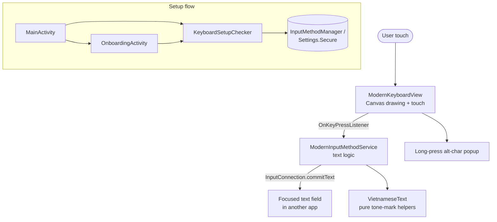

# Architecture Concepts — Rade Keyboard

## What This App Is

A native Android **Input Method Editor (IME)** — a system soft keyboard — for the
Vietnamese/Rade language. When the user selects Rade Keyboard as their input method,
Android binds the `ModernInputMethodService` and shows its view whenever a text field
is focused in any app.

There is **no backend, no database, and no network**. All state is in-memory and
lasts only as long as the IME session. The only persisted data is a single
`SharedPreferences` entry for the onboarding language toggle.

## Runtime Components

## Key Interactions

| Interaction | Mechanism |
|-------------|-----------|
| Key press → text | `ModernKeyboardView` emits via `OnKeyPressListener`; service commits with `InputConnection` |
| Tone mark on vowel | Delete preceding base char, re-commit `base + combining code point` |
| Shift / Caps lock | Service holds `isShiftPressed` / `isCapsLockOn`; view redraws via `updateShiftState` |
| Auto-capitalization | Service inspects text before cursor after space/enter/delete/sentence-end |
| Long-press alternates | View shows a `PopupWindow`; slide to select, release to commit |
| Continuous delete | Long-press DELETE deletes a word, then repeats after a start delay |
| Symbol / ABC toggle | `toggleSymbolMode()` swaps layout and recomputes keyboard height |
| Is keyboard set up? | `KeyboardSetupChecker` reads enabled IME list + `DEFAULT_INPUT_METHOD` |

## State (in-memory, per session)

| State | Owner | Notes |
|-------|-------|-------|
| Shift pressed | `ModernInputMethodService.isShiftPressed` | Cleared after one char |
| Caps lock | `ModernInputMethodService.isCapsLockOn` | Toggled by double-tap shift |
| Symbol mode | `ModernKeyboardView.isSymbolMode` | QWERTY vs symbols layout |
| Long-press / continuous-delete flags | `ModernKeyboardView` | Driven by `Handler` timers |
| Selected language | `SharedPreferences("app_prefs")` | Only persisted value; default `vi` |

## Localization

Strings live in `res/values/strings.xml` (English) and `res/values-vi/strings.xml`
(Vietnamese). The onboarding screen can switch locale at runtime; the default is
Vietnamese.
