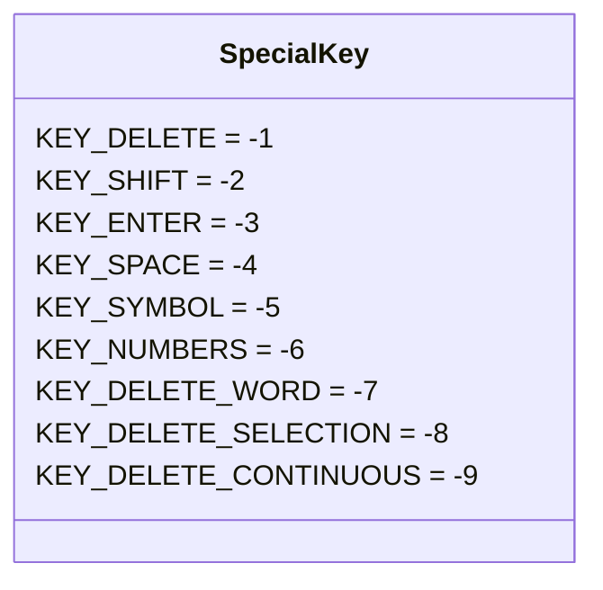
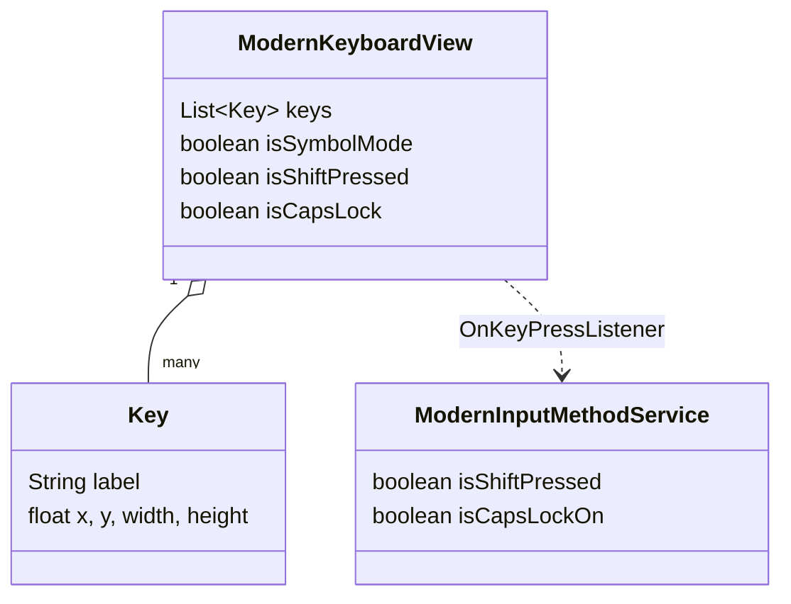

# Data Model — Rade Keyboard

This app has **no database**. In place of an entity-relationship diagram, this
document captures the app's real "data model": the key-event protocol between the
view and the service, the in-memory key structure, and the diacritic maps.

## Key-Event Protocol (View → Service)

The view communicates with the service through one interface:

```java
interface OnKeyPressListener {
    void onKeyPressed(String key, int keyCode);   // a character to commit
    void onSpecialKeyPressed(int specialKey);      // a KEY_* action
}
```

### Special key codes (`ModernKeyboardView.KEY_*`)



The service switches on these to perform deletion, shift/caps toggles, enter, space,
and layout switches.

## In-Memory Structures



## Diacritic / Alternate-Character Maps

Defined in `ModernKeyboardView`:

| Map | Type | Purpose |
|-----|------|---------|
| `QWERTY_LAYOUT` / `SYMBOL_LAYOUT` | `String[][]` | Row-by-row key labels per mode |
| `RADE_ALTS` | `Map<String,String[]>` | Long-press alternates per base key (tone marks, symbols, VN vowels) |
| `ALT_PREVIEW_COUNT` | `Map<String,Integer>` | How many alternates to preview on the key face |

## Combining Characters (`VietnameseText`)

Vietnamese tone marks are Unicode combining code points appended to a base vowel:

| Tone | Combining code point |
|------|----------------------|
| Grave (huyền) | `̀` |
| Acute (sắc) | `́` |
| Tilde (ngã) | `̃` |
| Hook above (hỏi) | `̉` |
| Dot below (nặng) | `̣` |
| Breve (ă) | `̆` |

Applied as: delete the preceding base char, re-commit `base + <combining>`.

## Persisted Data

Exactly one value is persisted, in `SharedPreferences("app_prefs")`:

| Key | Values | Default |
|-----|--------|---------|
| `selected_language` | `"en"` \| `"vi"` | `"vi"` |
