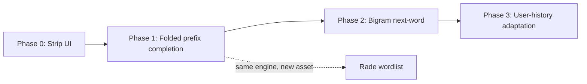

# Research: Text Prediction / Word Suggestions for Rade Keyboard (Vietnamese + English + Rade)

*Researched 2026-07-07 (web sources + codebase). Feeds Workstream 5 of
[`v2-usability-plan.md`](v2-usability-plan.md).*

## 1. Dictionary-based completion & next-word approaches

### How the mainstream open keyboards do it

Every serious open-source Android keyboard (AOSP LatinIME, OpenBoard, HeliBoard,
AnySoftKeyboard, FUTO) uses the same basic recipe: a **frequency-ranked unigram dictionary +
optional bigram ("next word") entries**, stored in a trie-like binary format, queried per
keystroke. Dictionary entries carry a frequency byte 1–255; n-gram entries enable next-word
prediction ([FUTO dictionary internals](https://deepwiki.com/futo-org/android-keyboard/6.2-dictionary-file-formats-and-io),
[AnySoftKeyboardSuggestions.java](https://github.com/AnySoftKeyboard/AnySoftKeyboard/blob/main/ime/app/src/main/java/com/anysoftkeyboard/ime/AnySoftKeyboardSuggestions.java)).
Keyboard-grade LMs are small: typically **< 10 MB, < 200K unigrams, < 1.5M n-grams** even at
Gboard scale ([Google, "Federated Learning of N-gram Language Models"](https://arxiv.org/pdf/1910.03432)).

For this app, a 30–75K-word list fits comfortably in a **plain Java structure** — no binary
format needed:

| Format | Notes |
|---|---|
| Sorted `String[]` of folded keys + parallel freq array, binary search for prefix range | Simplest; ~1–3 MB heap for 50K words; prefix lookup is two binary searches (µs). **Recommended.** |
| Hand-rolled prefix trie / DAWG | Faster prefix walks, more code + memory overhead; only worth it >200K words |
| AOSP `.dict` (binary trie) | Built with `dicttool_aosp.jar` ([remi0s/aosp-dictionary-tools](https://github.com/remi0s/aosp-dictionary-tools), [adnanchohan/AOSP_DictionaryTool](https://github.com/adnanchohan/AOSP_DictionaryTool)); **readable only by LatinIME's native C++ code** — useless without the JNI engine (§2). Its `.combined` *source* text format is worth borrowing as a data-pipeline format |
| Lucene FST | Overkill; large dependency for an IME |

### Concrete free word-frequency data

**Vietnamese:**
- **HermitDave FrequencyWords** (OpenSubtitles-derived, `word<space>count` per line):
  [`vi_50k.txt`](https://raw.githubusercontent.com/hermitdave/FrequencyWords/master/content/2016/vi/vi_50k.txt),
  repo at [github.com/hermitdave/FrequencyWords](https://github.com/hermitdave/FrequencyWords)
  (2016 + [2018 editions](https://github.com/hermitdave/FrequencyWords/tree/master/content/2018)).
  Best single source of *frequencies*. Caveats: lowercased, subtitle-register, tokens are
  **syllables** (Vietnamese is space-per-syllable), noise/foreign words in the tail — plan a
  cleanup pass (intersect with a real Vietnamese lexicon).
- **hunspell-vi** ([github.com/1ec5/hunspell-vi](https://github.com/1ec5/hunspell-vi)) — mature
  spell-check lexicon descended from Hồ Ngọc Đức's Free Vietnamese Dictionary Project. Good
  validity filter; **check license (GPL lineage) before embedding**.
- **Viet74K** ([duyet/vietnamese-wordlist](https://github.com/duyet/vietnamese-wordlist)) —
  ~74K entries **including multi-syllable words** — useful for phrase/bigram seeding.
- **underthesea dictionary** ([undertheseanlp/dictionary](https://github.com/undertheseanlp/dictionary))
  and the [awesome-vietnamese-nlp index](https://github.com/vndee/awsome-vietnamese-nlp).
- **Helium314/aosp-dictionaries** ([codeberg.org/Helium314/aosp-dictionaries](https://codeberg.org/Helium314/aosp-dictionaries)) —
  experimental Vietnamese `main` dictionary (~11,755 words) in both `.combined` (plain text,
  directly reusable) and `.dict`; per-dictionary licenses (CC BY, GPL, etc.).

**English:** HermitDave [`en_50k.txt`](https://github.com/hermitdave/FrequencyWords/tree/master/content/2018/en)
(same format), or [first20hours/google-10000-english](https://github.com/first20hours/google-10000-english)
for a minimal 10K list. 10–30K English words is plenty for a suggestion strip.

**Sizes:** vi_50k + en_50k as gzipped assets ≈ 300–500 KB APK cost; a curated 15K-syllable
Vietnamese list + 20K English list is ~250 KB raw.

## 2. Reusing the AOSP LatinIME suggestion engine — verdict: don't

The actual scorer lives in **C++ behind JNI**: `BinaryDictionary.getSuggestionsNative(...)` →
`libjni_latinime.so` ([BinaryDictionary.java, wikimedia LatinIME fork](https://github.com/wikimedia/aosp-morelangs-ime/blob/master/java/src/org/wikimedia/morelangs/latin/BinaryDictionary.java)).
Reusing it in Rade Keyboard would mean:

- Vendoring the whole `jni/` tree + NDK/CMake build (people resort to shipping **prebuilt
  `libjni_latinime.so`** to avoid building AOSP —
  [iwo/LatinIME-Android-Studio issue #2](https://github.com/iwo/LatinIME-Android-Studio/issues/2)).
- Porting a thick Java glue layer: `BinaryDictionary`, `DictionaryFacilitator`, `Suggest`,
  `SuggestedWords`, and — the painful part — **`ProximityInfo`**, because the native scorer
  wants key-coordinate geometry for typo correction. `ModernKeyboardView`'s custom layout model
  would have to be adapted to feed it.
- +1–2 MB of native lib per ABI, an NDK toolchain in a currently pure-Java single-module build,
  and logic that's untestable on the JVM (violates this repo's extract-and-unit-test strategy).

**Licensing is the one non-issue:** AOSP LatinIME is Apache 2.0 — fully compatible; just retain
notices. Precedents proving it *can* be done (OpenBoard → [HeliBoard](https://github.com/heliborg/heliboard),
[AnySoftKeyboard's JNI dictionary](https://github.com/AnySoftKeyboard/AnySoftKeyboard/blob/master/src/main/java/com/anysoftkeyboard/dictionaries/jni/ResourceBinaryDictionary.java),
[FUTO's LatinIME fork](https://gitlab.futo.org/keyboard/latinime)) are all *forks of LatinIME*,
not grafts onto a from-scratch IME. Realistic grafting effort: **15–25 days** plus ongoing
maintenance. A pure-Java engine gets ~90% of the UX for ~20% of that.

## 3. Vietnamese-specific considerations

- **Diacritic/tone-insensitive matching is the killer feature.** Vietnamese users routinely
  type bare ASCII and expect the IME to restore diacritics, exactly like pinyin
  ([Language Log on diacritic-less Vietnamese](https://languagelog.ldc.upenn.edu/nll/?p=46400)).
  Fold both dictionary keys and the typed prefix: Unicode NFD → strip `\p{Mn}` combining marks
  → special-case `đ/Đ → d` (đ does **not** decompose to d + mark). So folded `nguoi` matches
  `người`, ranked by frequency.
  **Repo-specific bonus:** this keyboard already commits *decomposed* sequences (base char +
  combining code point — see `learnings.md`), so folding text this IME produced is just "drop
  combining chars." But `getTextBeforeCursor()` can return **precomposed NFC** text typed by
  other keyboards — always normalize to NFD first. The folding logic belongs in a pure helper
  next to `VietnameseText`, with unit tests.
- **Syllable structure:** Vietnamese uses roughly **7,000–8,000 attested syllables**, and most
  words are 1–3 syllable compounds ([word-segmentation literature](https://arxiv.org/pdf/1709.06307),
  [VnCoreNLP](https://datquocnguyen.github.io/resources/VnCoreNLP_NAACL2018.pdf)). Practical
  consequence: the unigram lexicon is *small* (a complete syllable list is <10K entries), and
  **next-syllable bigrams carry most of the predictive value** (`Việt` → `Nam`, `không` →
  `phải`…). This makes Phase 2 unusually high-payoff for Vietnamese compared to English.
- **Existing Vietnamese IMEs don't help with prediction.** [UniKey](https://www.unikey.org/en/)
  (GPL engine), [OpenKey](https://github.com/tuyenvm/OpenKey), ibus-unikey, and
  [VKey](https://github.com/phatMT97/VKey) all implement *keystroke→diacritic transformation*
  (Telex/VNI), not dictionaries or prediction. Laban Key is closed. There is no open Vietnamese
  *suggestion engine* to reuse — only word lists (§1). UniKey/OpenKey are **GPL**: don't copy
  code, only concepts.
- **Rade (Ê Đê) extensibility:** essentially no digital corpus exists — resources are a
  ~1,000-word dialect vocabulary (Đoàn 1998, per [Wikipedia](https://en.wikipedia.org/wiki/Rade_language)),
  [SIL archive materials](https://www.sil.org/resources/archives/30996),
  [OLAC listings](http://www.language-archives.org/language/rad), and a Vietnamese–Ede
  bilingual vocabulary database built by a Vietnamese university group
  ([IEEE paper](https://ieeexplore.ieee.org/document/8030877/)). **Design implication:** the
  engine must be data-driven — "a language = a wordlist asset + a folding rule" — with uniform
  frequencies allowed, so a hand-built 1–5K Rade list works day one and user-history adaptation
  (Phase 3) supplies frequencies over time. Rade's Latin-plus-diacritics orthography passes
  through the same NFD folding pipeline unchanged.

## 4. On-device ML — overkill, skip

- **KenLM** quantizes to ~8-bit and binarizes well ([kenlm paper](https://kheafield.com/papers/avenue/kenlm.pdf),
  [estimation docs](https://kheafield.com/code/kenlm/estimation/)), but it's C++ → NDK again,
  plus you must train/prune an ARPA model yourself. A plain bigram table gives the same top-3
  next-word strip quality for Vietnamese at <1 MB.
- **TFLite / neural:** no off-the-shelf small next-word model for Vietnamese; you'd own a
  training pipeline. The cautionary tale is [FUTO Keyboard](https://docs.keyboard.futo.org/settings/textprediction):
  a LatinIME fork with a GGML transformer rescorer — English-only prediction and a **~136 MB
  app** driven by model payloads, vs. this app's few-MB footprint. Even FUTO keeps a trie
  dictionary as the fast primary path and uses the NN only for rescoring.
- Verdict: for a hobby IME serving vi/en/rade, ML adds 10–100 MB and weeks of work for marginal
  gain over frequency+bigram. Revisit only if users demand full-sentence prediction.

## 5. Android API facts

- **No special API is needed for a suggestion strip.** Two routes:
  1. `onCreateCandidatesView()` + `setCandidatesViewShown(boolean)` — the framework's dedicated
     candidates view ([InputMethodService docs](https://developer.android.com/reference/android/inputmethodservice/InputMethodService)).
     Transient by design, resizes the window when toggled (visual jumping), inconsistently
     themed across OEMs. AOSP LatinIME itself does **not** use it.
  2. **Build the strip into the input view** (recommended; what Gboard/LatinIME/HeliBoard do):
     in `onCreateInputView()`, return a vertical `LinearLayout` = `SuggestionStripView` (a
     simple horizontal row of 3 slots) stacked above `ModernKeyboardView`. Always present
     (avoids layout jumps); blank it when there are no candidates. **Repo note:** the strip is
     a sibling view — `ModernKeyboardView`'s height math stays untouched.
- **InputConnection usage:**
  - Context read: `getTextBeforeCursor(48, 0)` to find the current/previous word (may return
    `null` or truncated text in some apps — handle defensively). Refresh suggestions in
    `onUpdateSelection()` too (user can tap-move the cursor).
  - Committing a pick: `deleteSurroundingText(currentWordLength, 0)` then
    `commitText(suggestion + " ", 1)`. This **avoids** `setComposingText()`/
    `finishComposingText()` entirely — important because the existing tone-mark logic already
    does raw delete+recommit; a composing region would conflict and is only needed for
    underlining the current word.
  - Wrap multi-op commits in `beginBatchEdit()`/`endBatchEdit()`.
- **Sensitive fields:** check `EditorInfo.inputType` in `onStartInput()`; disable suggestions +
  history learning for `TYPE_TEXT_VARIATION_PASSWORD` / `VISIBLE_PASSWORD` / `WEB_PASSWORD` and
  `TYPE_TEXT_FLAG_NO_SUGGESTIONS`. Non-negotiable for an IME (consistent with the repo's
  no-logging privacy stance).
- **Perf:** prefix lookup over a 50K sorted array is microseconds — fine on the UI thread
  within the 16 ms frame budget. The slow part is *loading* the dictionary (~50–150 ms parse):
  do it once on a background thread at service `onCreate()`, swap in an immutable structure
  when ready (strip stays empty until then).

## 6. Recommended phased approach for this codebase

**Phase 0 — Suggestion strip UI (1–2 days).** `SuggestionStripView` above `ModernKeyboardView`
inside `onCreateInputView()`; tap → callback into the service (mirroring `OnKeyPressListener`);
theme-aware colors matching the night-mode palette. Hardcode dummy suggestions to validate.

**Phase 1 — Static frequency dictionary + diacritic-folded prefix completion (3–5 days).**
- New pure-Java classes (all JVM-unit-testable, per `testing-strategy.md`): `DiacriticFolder`
  (NFD + strip `Mn` + `đ→d`), `WordDictionary` (folded-key sorted array + freq, loaded from
  gzipped `assets/dict/{vi,en}.txt`), `SuggestionEngine` (current-word extraction, top-3 by
  frequency, exact-diacritic matches ranked above folded matches).
- Data prep: one-off script merging HermitDave `vi_50k` frequencies ∩ hunspell-vi/Viet74K
  validity; `en_50k` or google-10000 for English.
- Service wiring: recompute suggestions on each key event + `onUpdateSelection`; commit via
  `deleteSurroundingText` + `commitText`; disable in password fields.
- Memory: ~1–2 MB heap; APK +~400 KB.

**Phase 2 — Bigram next-word (3–5 days).** Precompute top-N (N≈4) followers per word from the
OpenSubtitles corpus (or approximate from Viet74K multi-syllable compounds: `người` →
`ta/dân/nào`). Compact binary asset of int-indexed pairs, ~0.5–1 MB. After space/punctuation,
the strip shows bigram predictions instead of completions. This is where Vietnamese quality
jumps, given its syllable-compound nature.

**Phase 3 — User-history adaptive dictionary (2–4 days).** Per-language unigram+bigram counts
in an app-private file (the app's first persisted data beyond the language pref — flag in
`context/product/decisions.md`); blend `score = staticFreq + k·userCount`; learn on word-commit
only, never in sensitive fields; a "clear learned words" action. **This is also the Rade
story:** ship a small SIL/V-EBVD-derived Rade wordlist with flat frequencies and let usage
build the frequency profile.

**Explicitly rejected:** LatinIME JNI graft (§2), KenLM/TFLite (§4), `setCandidatesViewShown` (§5).

Total: **~9–16 days** over four shippable increments, all core logic pure Java and unit-tested,
no new dependencies, no NDK, APK growth well under 2 MB.

## Sources

- https://github.com/hermitdave/FrequencyWords (+ 2018 content; background:
  https://invokeit.wordpress.com/2019/02/15/word-list-by-frequency-based-on-open-subtitle-corpus-2018/)
- https://github.com/1ec5/hunspell-vi · https://github.com/duyet/vietnamese-wordlist ·
  https://github.com/undertheseanlp/dictionary · https://github.com/vndee/awsome-vietnamese-nlp
- https://codeberg.org/Helium314/aosp-dictionaries · https://github.com/remi0s/aosp-dictionary-tools ·
  https://github.com/adnanchohan/AOSP_DictionaryTool
- https://github.com/wikimedia/aosp-morelangs-ime (BinaryDictionary.java) ·
  https://github.com/iwo/LatinIME-Android-Studio/issues/2
- https://github.com/AnySoftKeyboard/AnySoftKeyboard · https://github.com/heliborg/heliboard ·
  https://github.com/florisboard/florisboard/issues/325
- https://deepwiki.com/futo-org/android-keyboard · https://gitlab.futo.org/keyboard/latinime ·
  https://docs.keyboard.futo.org/settings/textprediction
- https://developer.android.com/reference/android/inputmethodservice/InputMethodService
- https://arxiv.org/pdf/1910.03432 · https://kheafield.com/papers/avenue/kenlm.pdf ·
  https://kheafield.com/code/kenlm/estimation/
- https://arxiv.org/pdf/1709.06307 · https://datquocnguyen.github.io/resources/VnCoreNLP_NAACL2018.pdf
- https://languagelog.ldc.upenn.edu/nll/?p=46400 · https://en.wikipedia.org/wiki/UniKey_(software) ·
  https://github.com/tuyenvm/OpenKey · https://github.com/phatMT97/VKey
- https://en.wikipedia.org/wiki/Rade_language · https://ieeexplore.ieee.org/document/8030877/ ·
  https://www.sil.org/resources/archives/30996 · http://www.language-archives.org/language/rad
